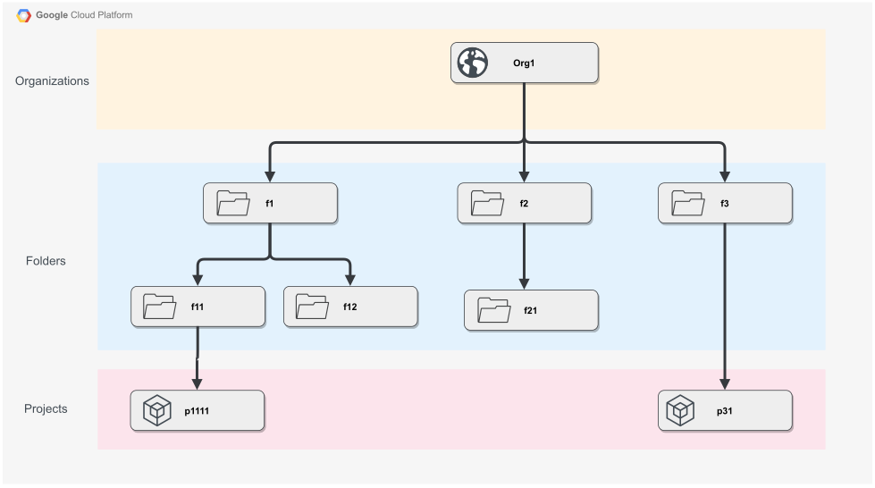

# Graph Representation of permission policies in Google Cloud Platform

## Example of Resource Hierarchy



---

### Run the project

- If you use pipenv as virtual environment manager then:

    ```bash
    pipenv install
    pipenv shell
    python main.py
    ```

- If you use venv then:

    ```bash
    python3 -m venv /path/to/virtualenvironment
    source /path/to/virtualenvironment/bin/activate
    pip install -r requirements.txt
    python main.py
    ```
